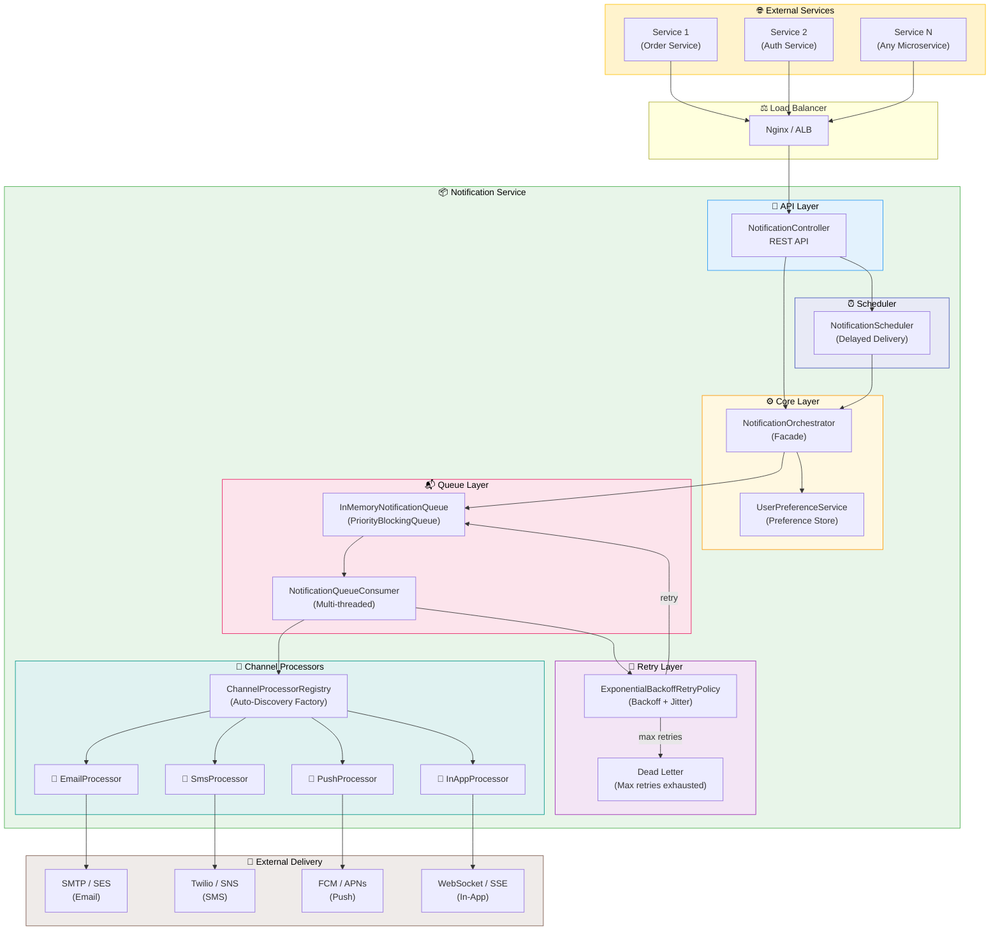
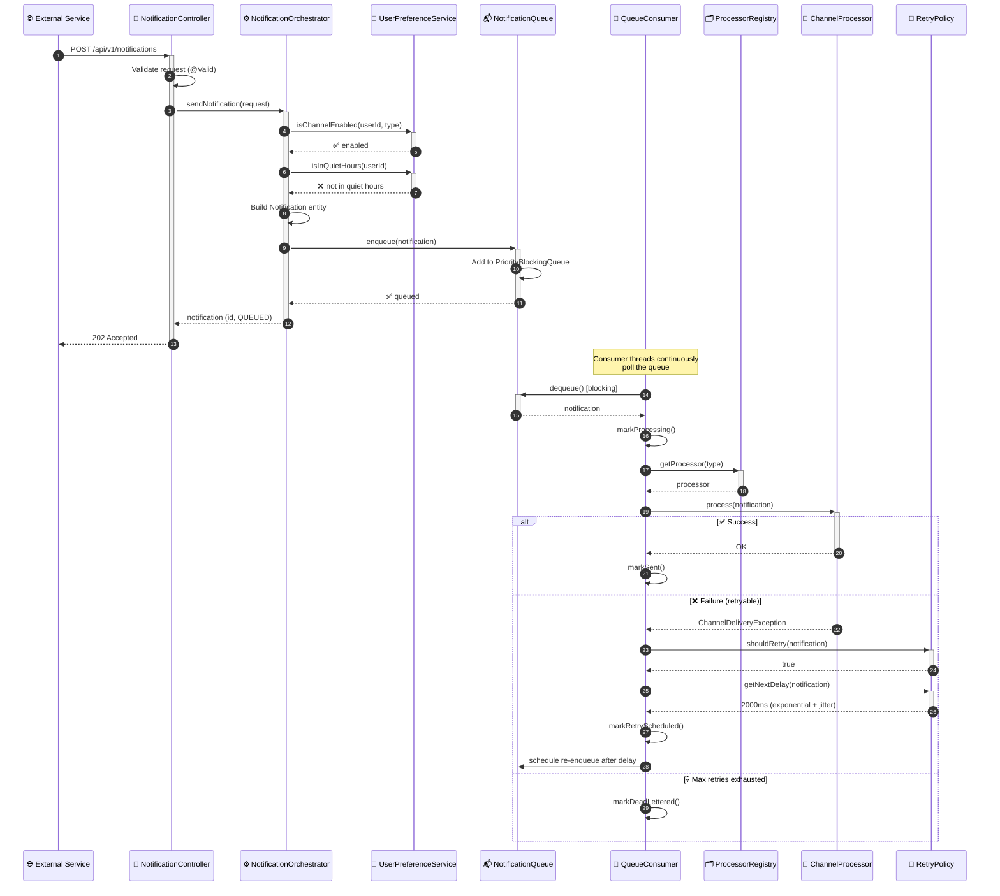
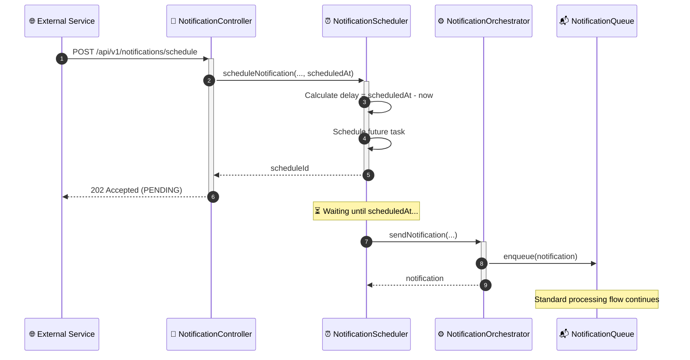
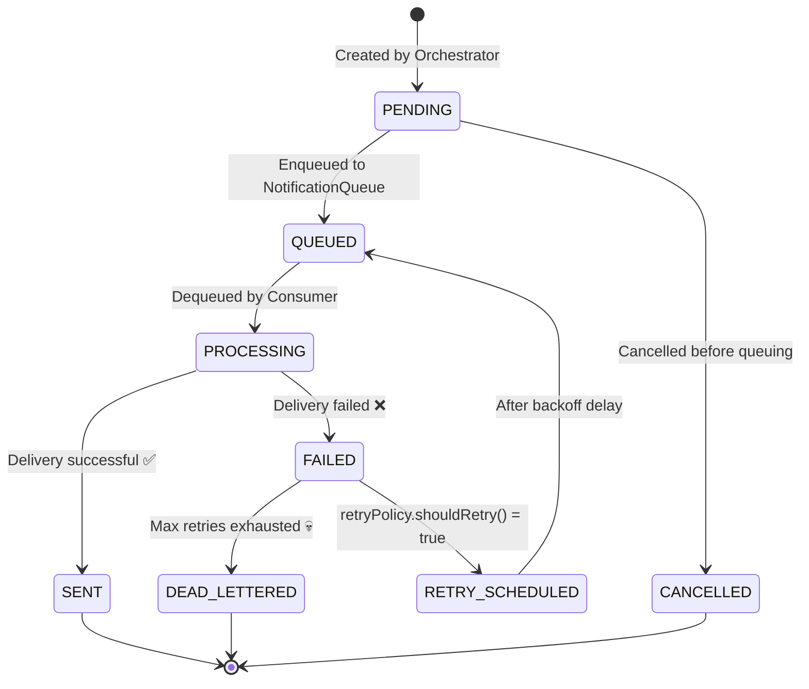
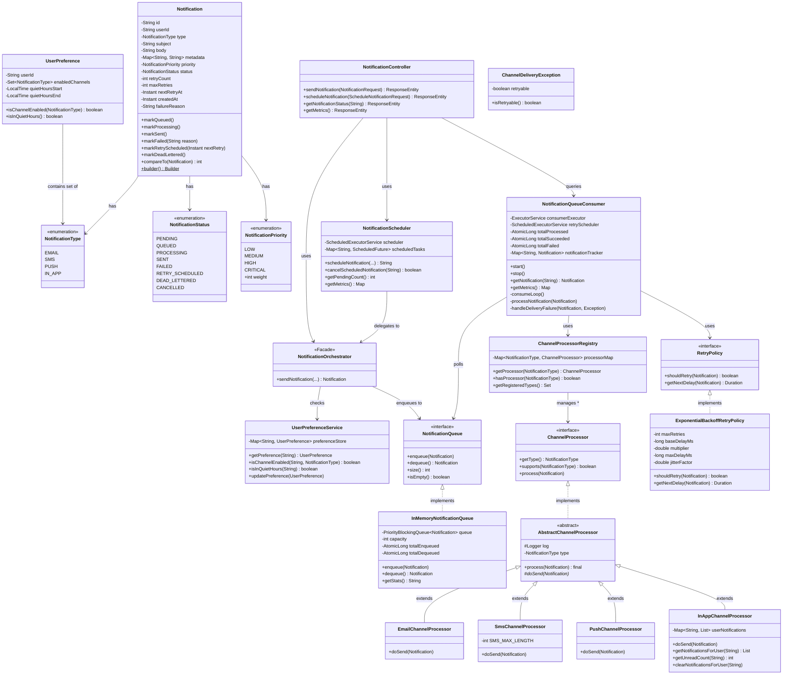

<p align="center">
  
  
  
  
</p>

# 🔔 Notification Service

> A **production-grade, scalable notification service** supporting Email, SMS, Push, and In-App channels with priority queuing, exponential backoff retry, scheduled delivery, and user preference management.

Built following **SOLID principles** and industry-standard design patterns to ensure extensibility — adding a new notification channel requires **zero changes** to existing code.

---

## 📑 Table of Contents

- [High-Level Architecture](#-high-level-architecture)
- [System Interaction Flow](#-system-interaction-flow)
- [Notification Lifecycle](#-notification-lifecycle)
- [Retry Mechanism](#-retry-mechanism--exponential-backoff-with-jitter)
- [Class Diagram](#-class-diagram)
- [Package Structure](#-package-structure)
- [Design Patterns](#-design-patterns)
- [SOLID Principles](#-solid-principles)
- [API Reference](#-api-reference)
- [Configuration](#%EF%B8%8F-configuration)
- [Getting Started](#-getting-started)
- [Adding a New Channel](#-adding-a-new-channel)
- [Tech Stack](#-tech-stack)

---

## 🏗 High-Level Architecture



---

## 🔄 System Interaction Flow

### Immediate Notification Flow



### Scheduled Notification Flow



---

## 🔄 Notification Lifecycle



---

## 🔁 Retry Mechanism — Exponential Backoff with Jitter

The retry mechanism uses **exponential backoff with jitter** to prevent the thundering herd problem.

### Formula

```
delay = min(baseDelay × multiplier^retryCount × (1 ± jitterFactor), maxDelay)
```

### Retry Timeline (with defaults)

```mermaid
gantt
    title Retry Timeline (baseDelay=1s, multiplier=2x, jitter=±20%)
    dateFormat X
    axisFormat %s sec

    section Attempt 1
    Send & Fail           :crit, 0, 100
    Backoff ~1.0s         :active, 100, 1100

    section Attempt 2
    Send & Fail           :crit, 1100, 1200
    Backoff ~2.0s         :active, 1200, 3200

    section Attempt 3
    Send & Fail           :crit, 3200, 3300
    Backoff ~4.0s         :active, 3300, 7300

    section Final Attempt
    Send & Fail           :crit, 7300, 7400
    DEAD LETTERED 💀      :done, 7400, 8000
```



### Configuration

| Parameter | Default | Description |
|-----------|---------|-------------|
| `max-retries` | `3` | Maximum retry attempts per notification |
| `base-delay-ms` | `1000` | Initial backoff delay (1 second) |
| `multiplier` | `2.0` | Exponential growth factor |
| `max-delay-ms` | `30000` | Maximum delay cap (30 seconds) |
| `jitter-factor` | `0.2` | ±20% randomization |

### Retryable vs Non-Retryable

| Failure Type | Example | Action |
|---|---|---|
| **Retryable** | SMTP timeout, FCM unavailable, network error | Retry with backoff |
| **Non-retryable** | Invalid email address, missing device token | Dead-letter immediately |

---

## 📐 Class Diagram



---

## 📁 Package Structure

```
com.notification_service/
│
├── 🔌 api/                              ← REST API Layer
│   ├── controller/
│   │   └── NotificationController        4 REST endpoints
│   ├── dto/
│   │   ├── NotificationRequest           Input DTO (validated)
│   │   ├── NotificationResponse          Output DTO (factory methods)
│   │   └── ScheduleNotificationRequest   Schedule DTO
│   └── exception/
│       ├── GlobalExceptionHandler        Uniform error responses
│       └── NotificationException         Custom exception + error codes
│
├── ⚙️ core/                              ← Domain Layer
│   ├── model/
│   │   ├── Notification                  Domain entity (Builder + Comparable)
│   │   ├── NotificationType              EMAIL | SMS | PUSH | IN_APP
│   │   ├── NotificationStatus            PENDING → QUEUED → SENT / DEAD_LETTERED
│   │   ├── NotificationPriority          LOW | MEDIUM | HIGH | CRITICAL
│   │   └── UserPreference                Per-user channel + quiet hours config
│   └── service/
│       ├── NotificationOrchestrator      Facade — single entry point
│       └── UserPreferenceService         Preference store
│
├── 📡 channel/                            ← Channel Processors (Strategy Pattern)
│   ├── ChannelProcessor                  Strategy interface
│   ├── AbstractChannelProcessor          Template Method base (logging, timing)
│   ├── ChannelDeliveryException          Retryable vs non-retryable errors
│   ├── ChannelProcessorRegistry          Factory — auto-discovers processors
│   ├── email/EmailChannelProcessor       📧 Email delivery
│   ├── sms/SmsChannelProcessor           💬 SMS delivery
│   ├── push/PushChannelProcessor         📱 Push notifications
│   └── inapp/InAppChannelProcessor       🔔 In-app notifications
│
├── 📬 queue/                              ← Notification Queue
│   ├── NotificationQueue                 Interface (swappable for Kafka/RabbitMQ)
│   ├── InMemoryNotificationQueue         PriorityBlockingQueue implementation
│   └── NotificationQueueConsumer         Multi-threaded consumer + retry handler
│
├── 🔁 retry/                              ← Retry Mechanism
│   ├── RetryPolicy                       Interface
│   └── ExponentialBackoffRetryPolicy     Backoff + jitter implementation
│
└── ⏰ scheduler/                          ← Scheduler Service
    └── NotificationScheduler             Delayed/scheduled delivery
```

---

## 🎨 Design Patterns

| Pattern | Where | Why |
|---------|-------|-----|
| **Strategy** | `ChannelProcessor` interface + 4 implementations | Swap notification channels without modifying orchestrator |
| **Template Method** | `AbstractChannelProcessor.process()` calls `doSend()` | Shared logging/timing/error-handling; subclasses only define delivery logic |
| **Factory / Registry** | `ChannelProcessorRegistry` | Auto-discovers all channel beans at startup; O(1) lookup by type |
| **Facade** | `NotificationOrchestrator` | Single entry point hiding queue, preferences, validation complexity |
| **Builder** | `Notification.builder()` | Clean construction of complex domain objects |
| **Observer** | `NotificationQueueConsumer` polling `NotificationQueue` | Decouple notification production from consumption |

---

## ✅ SOLID Principles

| Principle | Implementation |
|-----------|---------------|
| **S** — Single Responsibility | Each class has exactly one job: `EmailChannelProcessor` sends emails, `ChannelProcessorRegistry` resolves processors, `ExponentialBackoffRetryPolicy` calculates delays |
| **O** — Open/Closed | Add a new channel by creating a new `ChannelProcessor` implementation — **zero changes to existing code** |
| **L** — Liskov Substitution | All processors are interchangeable via `ChannelProcessor` interface; all queues via `NotificationQueue` |
| **I** — Interface Segregation | Thin, focused interfaces: `ChannelProcessor` (3 methods), `NotificationQueue` (4 methods), `RetryPolicy` (2 methods) |
| **D** — Dependency Inversion | `NotificationOrchestrator` depends on `NotificationQueue` interface, not `InMemoryNotificationQueue` concrete class |

---

## 📡 API Reference

### 1. Send Notification

```http
POST /api/v1/notifications
Content-Type: application/json
```

**Request Body:**
```json
{
  "userId": "user-123",
  "type": "EMAIL",
  "subject": "Welcome!",
  "body": "Hello, welcome to our platform!",
  "metadata": {
    "email": "user@example.com"
  },
  "priority": "HIGH"
}
```

**Channel-specific `metadata`:**

| Channel | Required Fields |
|---------|----------------|
| `EMAIL` | `"email": "user@example.com"` |
| `SMS` | `"phoneNumber": "+919876543210"` |
| `PUSH` | `"deviceToken": "fcm_xyz"`, `"platform": "ANDROID"` |
| `IN_APP` | *(none required)* |

**Response: `202 Accepted`**
```json
{
  "notificationId": "bed8080e-d485-4048-a83d-d8a30d8c4fd8",
  "status": "QUEUED",
  "type": "EMAIL",
  "message": "Notification accepted and queued for delivery via EMAIL",
  "timestamp": "2026-05-01T19:23:36.814Z"
}
```

---

### 2. Schedule Notification

```http
POST /api/v1/notifications/schedule
Content-Type: application/json
```

**Request Body:**
```json
{
  "userId": "user-123",
  "type": "IN_APP",
  "subject": "Reminder",
  "body": "Your subscription expires tomorrow",
  "metadata": {},
  "priority": "MEDIUM",
  "scheduledAt": "2026-05-02T10:00:00Z"
}
```

**Response: `202 Accepted`**
```json
{
  "notificationId": "schedule-1542f5c0",
  "status": "PENDING",
  "type": "IN_APP",
  "message": "Notification scheduled for delivery at 2026-05-02T10:00:00Z via IN_APP",
  "timestamp": "2026-05-01T19:24:26.991Z"
}
```

---

### 3. Check Status

```http
GET /api/v1/notifications/{id}/status
```

**Response: `200 OK`**
```json
{
  "notificationId": "bed8080e-d485-4048-a83d-d8a30d8c4fd8",
  "status": "SENT",
  "type": "EMAIL",
  "message": "Notification status: SENT",
  "timestamp": "2026-05-01T19:23:55.476Z"
}
```

---

### 4. System Metrics

```http
GET /api/v1/notifications/metrics
```

**Response: `200 OK`**
```json
{
  "message": "Current system metrics",
  "metrics": {
    "totalProcessed": 8,
    "totalSucceeded": 4,
    "totalFailed": 4,
    "totalRetried": 3,
    "totalDeadLettered": 1,
    "queueSize": 0
  }
}
```

---

### Error Responses

**Validation Error: `400 Bad Request`**
```json
{
  "timestamp": "2026-05-01T19:24:32.608Z",
  "status": 400,
  "error": "Bad Request",
  "errorCode": "VALIDATION_FAILED",
  "message": "Request validation failed",
  "details": "body: body is required, userId: userId is required"
}
```

**Queue Full: `503 Service Unavailable`**
```json
{
  "timestamp": "...",
  "status": 503,
  "error": "Service Unavailable",
  "errorCode": "QUEUE_FULL",
  "message": "Notification queue is full (capacity=10000). Notification xyz rejected."
}
```

---

## ⚙️ Configuration

All tunable parameters are externalized in `application.yml`:

```yaml
notification:
  queue:
    capacity: 10000               # Max items in the in-memory queue
    consumer-threads: 4           # Number of concurrent queue consumers

  retry:
    max-retries: 3                # Maximum retry attempts per notification
    base-delay-ms: 1000           # Initial backoff delay (milliseconds)
    multiplier: 2.0               # Exponential backoff multiplier
    max-delay-ms: 30000           # Maximum delay cap (milliseconds)
    jitter-factor: 0.2            # ±20% jitter to prevent thundering herd

  scheduler:
    pool-size: 2                  # Scheduler thread pool size

  async:
    core-pool-size: 4             # Async executor core threads
    max-pool-size: 8              # Async executor max threads
    queue-capacity: 500           # Async executor queue capacity
```

---

## 🚀 Getting Started

### Prerequisites
- Java 17+
- Maven 3.8+

### Build & Run

```bash
# Clone the repository
git clone <repo-url>
cd notification-service

# Build
./mvnw clean compile

# Run
./mvnw spring-boot:run
```

### Quick Test

```bash
# Send an email notification
curl -X POST http://localhost:8080/api/v1/notifications \
  -H "Content-Type: application/json" \
  -d '{
    "userId": "user-123",
    "type": "EMAIL",
    "subject": "Hello!",
    "body": "Welcome to the notification service!",
    "metadata": {"email": "test@example.com"},
    "priority": "HIGH"
  }'

# Check system metrics
curl http://localhost:8080/api/v1/notifications/metrics
```

---

## 🔌 Adding a New Channel

Adding a new notification channel (e.g., **WhatsApp**) requires **exactly 2 changes** and **zero modifications** to existing code:

### Step 1: Add enum constant

```java
// NotificationType.java
public enum NotificationType {
    EMAIL, SMS, PUSH, IN_APP,
    WHATSAPP  // ← Add this
}
```

### Step 2: Create the processor

```java
@Component
public class WhatsAppChannelProcessor extends AbstractChannelProcessor {

    public WhatsAppChannelProcessor() {
        super(NotificationType.WHATSAPP);
    }

    @Override
    protected void doSend(Notification notification) {
        String phoneNumber = notification.getMetadata().get("phoneNumber");
        // Call WhatsApp Business API here
        log.info("[WHATSAPP] Sent to: {}", phoneNumber);
    }
}
```

**That's it!** The `ChannelProcessorRegistry` auto-discovers it at startup via Spring's component scan. No factory changes, no if-else chains, no registry modifications.

---

## 🛠 Tech Stack

| Technology | Purpose |
|---|---|
| **Spring Boot 4.0.6** | Application framework |
| **Java 17** | Language |
| **Jakarta Validation** | Request validation (`@Valid`, `@NotBlank`) |
| **PriorityBlockingQueue** | In-memory priority queue |
| **ScheduledExecutorService** | Retry scheduling + delayed notifications |
| **SLF4J + Logback** | Structured logging |

---

## 📜 License

This project is open-sourced for educational purposes.

---

<p align="center">
  <b>Built with ❤️ following industry-standard system design principles</b>
</p>
