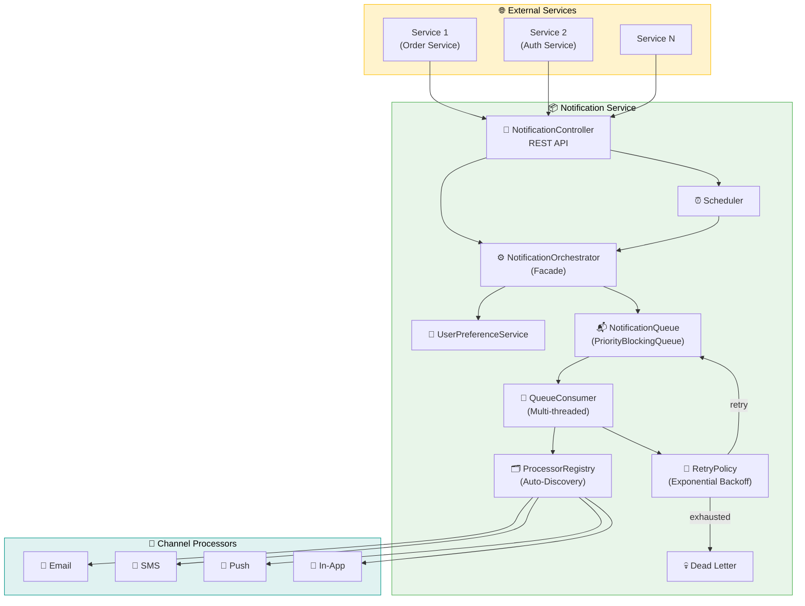
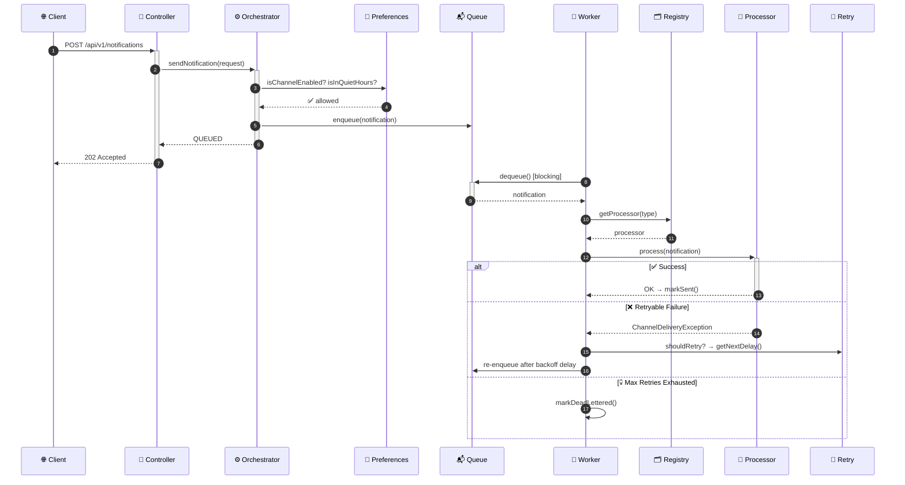
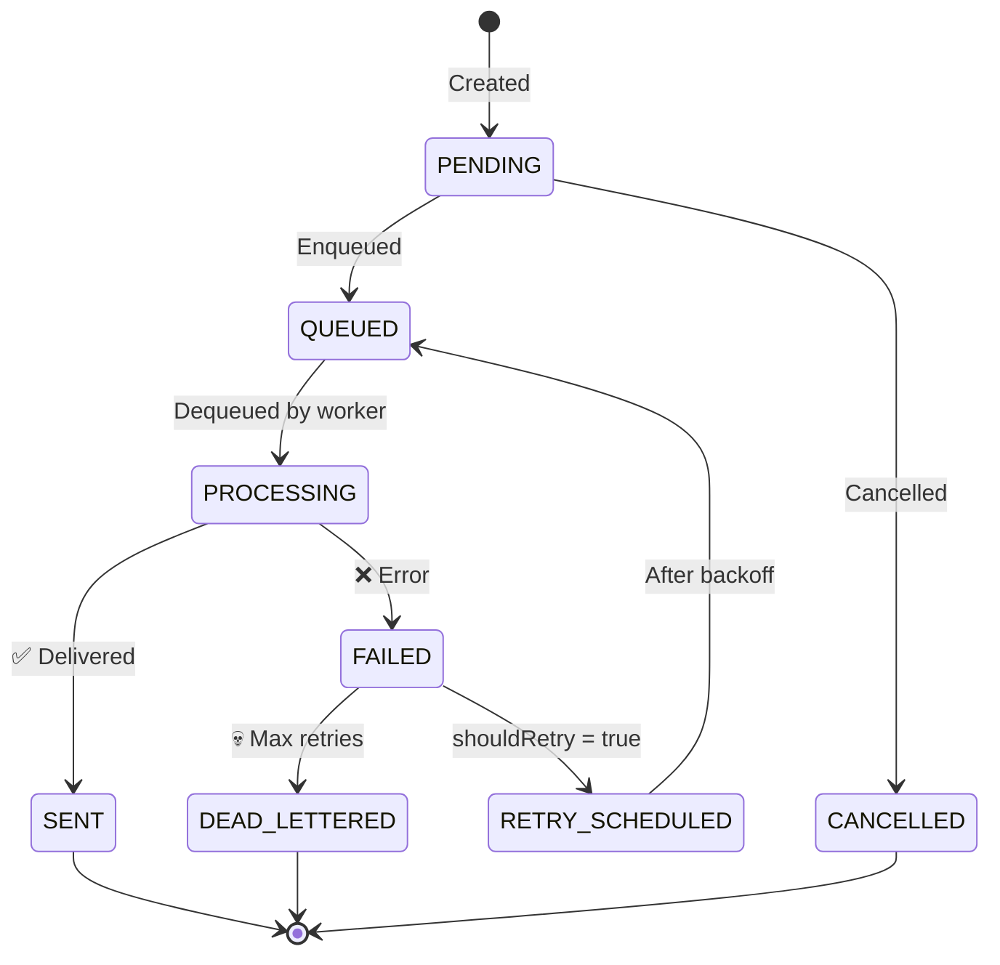
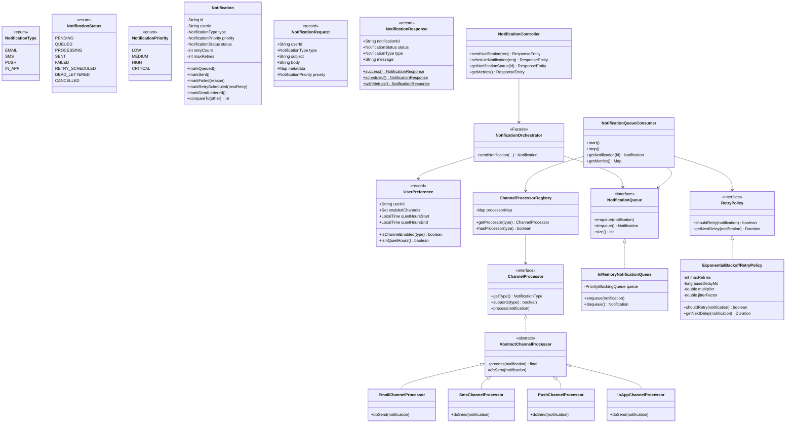

<p align="center">
  
  
  
  
</p>

# 🔔 Notification Service

> A **production-grade, scalable notification service** supporting Email, SMS, Push, and In-App channels with priority queuing, exponential backoff retry, scheduled delivery, and user preference management.

Built following **SOLID principles** and industry-standard design patterns — adding a new channel requires **zero changes** to existing code.

---

## 📑 Table of Contents

- [High-Level Architecture](#-high-level-architecture)
- [System Interaction Flow](#-system-interaction-flow)
- [Notification Lifecycle](#-notification-lifecycle)
- [Retry Mechanism](#-retry-mechanism)
- [Class Diagram](#-class-diagram)
- [Package Structure](#-package-structure)
- [Design Patterns & SOLID](#-design-patterns--solid-principles)
- [Demo API Reference](#-demo-api-reference)
- [Configuration](#%EF%B8%8F-configuration)
- [Getting Started](#-getting-started)
- [Adding a New Channel](#-adding-a-new-channel)

---

## 🏗 High-Level Architecture



---

## 🔄 System Interaction Flow



---

## 🔄 Notification Lifecycle



---

## 🔁 Retry Mechanism

**Formula:** `delay = baseDelay × multiplier^retryCount × (1 ± jitterFactor)`

| Attempt | Delay (approx.) | Status |
|---------|-----------------|--------|
| 1st fail | ~1000ms | RETRY_SCHEDULED |
| 2nd fail | ~2000ms | RETRY_SCHEDULED |
| 3rd fail | ~4000ms | RETRY_SCHEDULED |
| 4th fail | — | 💀 DEAD_LETTERED |

| Config | Default | Description |
|--------|---------|-------------|
| `max-retries` | `3` | Max retry attempts |
| `base-delay-ms` | `1000` | Initial backoff (1s) |
| `multiplier` | `2.0` | Exponential factor |
| `max-delay-ms` | `30000` | Max delay cap (30s) |
| `jitter-factor` | `0.2` | ±20% randomization |

---

## 📐 Class Diagram



---

## 📁 Package Structure

```
com.notification_service/
├── api/
│   ├── controller/NotificationController.java    ← 4 REST endpoints
│   ├── dto/
│   │   ├── NotificationRequest.java              ← record (validated)
│   │   ├── NotificationResponse.java             ← record (factory methods)
│   │   └── ScheduleNotificationRequest.java      ← record
│   └── exception/
│       ├── GlobalExceptionHandler.java            ← Uniform error responses
│       └── NotificationException.java
├── channel/
│   ├── ChannelProcessor.java                      ← Strategy interface
│   ├── AbstractChannelProcessor.java              ← Template Method
│   ├── ChannelProcessorRegistry.java              ← Factory/Registry
│   ├── ChannelDeliveryException.java
│   ├── email/EmailChannelProcessor.java
│   ├── sms/SmsChannelProcessor.java
│   ├── push/PushChannelProcessor.java
│   └── inapp/InAppChannelProcessor.java
├── core/
│   ├── model/
│   │   ├── Notification.java                      ← Domain entity (Builder)
│   │   ├── NotificationType.java                  ← EMAIL|SMS|PUSH|IN_APP
│   │   ├── NotificationStatus.java                ← Full lifecycle
│   │   ├── NotificationPriority.java              ← LOW→CRITICAL
│   │   └── UserPreference.java                    ← record (immutable)
│   └── service/
│       ├── NotificationOrchestrator.java           ← Facade
│       └── UserPreferenceService.java
├── queue/
│   ├── NotificationQueue.java                     ← Interface
│   ├── InMemoryNotificationQueue.java             ← PriorityBlockingQueue
│   └── NotificationQueueConsumer.java             ← Multi-threaded worker
├── retry/
│   ├── RetryPolicy.java                           ← Interface
│   └── ExponentialBackoffRetryPolicy.java         ← Backoff + jitter
└── scheduler/
    └── NotificationScheduler.java                 ← Delayed delivery
```

---

## 🎨 Design Patterns & SOLID Principles

| Pattern | Where | Purpose |
|---------|-------|---------|
| **Strategy** | `ChannelProcessor` | Pluggable channel implementations |
| **Template Method** | `AbstractChannelProcessor` | Shared logging/timing; subclasses define `doSend()` |
| **Factory/Registry** | `ChannelProcessorRegistry` | Auto-discovers processors via Spring DI |
| **Facade** | `NotificationOrchestrator` | Single entry point hiding complexity |
| **Builder** | `Notification.builder()` | Clean entity construction |

| SOLID | How |
|-------|-----|
| **S** – Single Responsibility | Each class has one job |
| **O** – Open/Closed | New channel = new class, zero existing changes |
| **L** – Liskov Substitution | All processors interchangeable via interface |
| **I** – Interface Segregation | Thin interfaces: `ChannelProcessor`(3), `RetryPolicy`(2) |
| **D** – Dependency Inversion | Depend on `NotificationQueue` interface, not concrete class |

---

## 📡 Demo API Reference

> **Base URL:** `http://localhost:8080/api/v1/notifications`

### 1. 📧 Send Email Notification

```bash
curl -X POST http://localhost:8080/api/v1/notifications \
  -H "Content-Type: application/json" \
  -d '{
    "userId": "user-001",
    "type": "EMAIL",
    "subject": "Welcome to Our Platform!",
    "body": "Hi John, welcome aboard! Your account has been successfully created.",
    "metadata": {
      "email": "john.doe@example.com"
    },
    "priority": "HIGH"
  }'
```

**Response `202 Accepted`:**
```json
{
    "notificationId": "039976ad-1091-4b3b-8595-6d55b762e453",
    "status": "QUEUED",
    "type": "EMAIL",
    "message": "Notification accepted and queued for delivery via EMAIL",
    "timestamp": "2026-05-01T20:23:04.371309Z",
    "metrics": null
}
```

---

### 2. 💬 Send SMS Notification

```bash
curl -X POST http://localhost:8080/api/v1/notifications \
  -H "Content-Type: application/json" \
  -d '{
    "userId": "user-002",
    "type": "SMS",
    "subject": "OTP Verification",
    "body": "Your OTP is 847293. Valid for 5 minutes. Do not share this code.",
    "metadata": {
      "phoneNumber": "+919876543210"
    },
    "priority": "CRITICAL"
  }'
```

**Response `202 Accepted`:**
```json
{
    "notificationId": "a400e42b-442f-45d6-91a5-3afb40eb553c",
    "status": "QUEUED",
    "type": "SMS",
    "message": "Notification accepted and queued for delivery via SMS",
    "timestamp": "2026-05-01T20:23:07.848124Z",
    "metrics": null
}
```

---

### 3. 📱 Send Push Notification

```bash
curl -X POST http://localhost:8080/api/v1/notifications \
  -H "Content-Type: application/json" \
  -d '{
    "userId": "user-003",
    "type": "PUSH",
    "subject": "New Message from Sarah",
    "body": "Hey! Are you coming to the meeting at 3 PM today?",
    "metadata": {
      "deviceToken": "dGhpcyBpcyBhIHRlc3QgZGV2aWNlIHRva2Vu",
      "platform": "ANDROID"
    },
    "priority": "MEDIUM"
  }'
```

**Response `202 Accepted`:**
```json
{
    "notificationId": "a44ead7b-d532-401d-866c-cf4e8aaea054",
    "status": "QUEUED",
    "type": "PUSH",
    "message": "Notification accepted and queued for delivery via PUSH",
    "timestamp": "2026-05-01T20:23:10.185252Z",
    "metrics": null
}
```

---

### 4. 🔔 Send In-App Notification

```bash
curl -X POST http://localhost:8080/api/v1/notifications \
  -H "Content-Type: application/json" \
  -d '{
    "userId": "user-004",
    "type": "IN_APP",
    "subject": "Achievement Unlocked 🏆",
    "body": "Congratulations! You earned the Gold Contributor badge for 100 contributions.",
    "metadata": {},
    "priority": "LOW"
  }'
```

**Response `202 Accepted`:**
```json
{
    "notificationId": "6f243be2-06db-4091-97ee-70bbdd4f23f7",
    "status": "QUEUED",
    "type": "IN_APP",
    "message": "Notification accepted and queued for delivery via IN_APP",
    "timestamp": "2026-05-01T20:23:10.239269Z",
    "metrics": null
}
```

---

### 5. ⏰ Schedule Email for Later

```bash
curl -X POST http://localhost:8080/api/v1/notifications/schedule \
  -H "Content-Type: application/json" \
  -d '{
    "userId": "user-005",
    "type": "EMAIL",
    "subject": "Payment Reminder",
    "body": "Your subscription payment of $9.99 is due tomorrow.",
    "metadata": {
      "email": "billing@example.com"
    },
    "priority": "HIGH",
    "scheduledAt": "2026-05-02T10:00:00Z"
  }'
```

**Response `202 Accepted`:**
```json
{
    "notificationId": "schedule-853c2d46",
    "status": "PENDING",
    "type": "EMAIL",
    "message": "Notification scheduled for delivery at 2026-05-02T10:00:00Z via EMAIL",
    "timestamp": "2026-05-01T20:23:23.111432Z",
    "metrics": null
}
```

---

### 6. ⏰ Schedule SMS for Later

```bash
curl -X POST http://localhost:8080/api/v1/notifications/schedule \
  -H "Content-Type: application/json" \
  -d '{
    "userId": "user-006",
    "type": "SMS",
    "subject": "Appointment",
    "body": "Reminder: You have a dentist appointment at 4:30 PM today.",
    "metadata": {
      "phoneNumber": "+14155551234"
    },
    "priority": "MEDIUM",
    "scheduledAt": "2026-05-02T16:00:00Z"
  }'
```

**Response `202 Accepted`:**
```json
{
    "notificationId": "schedule-38207fb1",
    "status": "PENDING",
    "type": "SMS",
    "message": "Notification scheduled for delivery at 2026-05-02T16:00:00Z via SMS",
    "timestamp": "2026-05-01T20:23:23.128766Z",
    "metrics": null
}
```

---

### 7. 🔍 Check Notification Status

```bash
curl http://localhost:8080/api/v1/notifications/039976ad-1091-4b3b-8595-6d55b762e453/status
```

**Response `200 OK`:**
```json
{
    "notificationId": "039976ad-1091-4b3b-8595-6d55b762e453",
    "status": "SENT",
    "type": "EMAIL",
    "message": "Notification status: SENT",
    "timestamp": "2026-05-01T20:23:34.005403Z",
    "metrics": null
}
```

---

### 8. 📊 System Metrics

```bash
curl http://localhost:8080/api/v1/notifications/metrics
```

**Response `200 OK`:**
```json
{
    "notificationId": null,
    "status": null,
    "type": null,
    "message": "Current system metrics",
    "timestamp": "2026-05-01T20:23:53.008070Z",
    "metrics": {
        "totalProcessed": 10,
        "totalSucceeded": 6,
        "totalFailed": 4,
        "totalRetried": 3,
        "totalDeadLettered": 1,
        "queueSize": 0
    }
}
```

---

### 9. 🔁 Retry Demo (Simulated Failure → Dead Letter)

```bash
curl -X POST http://localhost:8080/api/v1/notifications \
  -H "Content-Type: application/json" \
  -d '{
    "userId": "user-retry",
    "type": "EMAIL",
    "subject": "Retry Demo",
    "body": "This notification will fail and trigger exponential backoff retry",
    "metadata": {
      "email": "retry@demo.com",
      "simulateFailure": "true"
    },
    "priority": "HIGH"
  }'
```

**Server logs show exponential backoff:**
```
Attempt 1 → FAILED → Retry scheduled (delay: ~1041ms)
Attempt 2 → FAILED → Retry scheduled (delay: ~1924ms)
Attempt 3 → FAILED → Retry scheduled (delay: ~4268ms)
Attempt 4 → FAILED → Max retries exhausted → DEAD_LETTERED 💀
```

**Status check after retries:**
```json
{
    "notificationId": "ccd3b309-d2d2-48c7-b954-dba224711ec3",
    "status": "DEAD_LETTERED",
    "type": "EMAIL",
    "message": "Notification status: DEAD_LETTERED",
    "timestamp": "2026-05-01T20:23:53.070437Z",
    "metrics": null
}
```

---

### 10. ❌ Validation Error

```bash
curl -X POST http://localhost:8080/api/v1/notifications \
  -H "Content-Type: application/json" \
  -d '{"userId": "", "body": ""}'
```

**Response `400 Bad Request`:**
```json
{
    "timestamp": "2026-05-01T20:23:34.102040Z",
    "status": 400,
    "error": "Bad Request",
    "errorCode": "VALIDATION_FAILED",
    "message": "Request validation failed",
    "details": "body: body is required, type: type is required (EMAIL, SMS, PUSH, IN_APP), userId: userId is required"
}
```

---

### 11. 🔍 Not Found

```bash
curl http://localhost:8080/api/v1/notifications/nonexistent-id/status
```

**Response `404 Not Found`:**
```json
{
    "notificationId": null,
    "status": null,
    "type": null,
    "message": "Notification not found: nonexistent-id",
    "timestamp": "2026-05-01T20:23:34.126873Z",
    "metrics": null
}
```

---

### Channel-Specific Metadata Reference

| Channel | Required `metadata` Fields | Example |
|---------|---------------------------|---------|
| `EMAIL` | `email` | `{"email": "user@example.com"}` |
| `SMS` | `phoneNumber` | `{"phoneNumber": "+919876543210"}` |
| `PUSH` | `deviceToken`, `platform` | `{"deviceToken": "abc123", "platform": "ANDROID"}` |
| `IN_APP` | *(none required)* | `{}` |

### Priority Levels

| Priority | Weight | Use Case |
|----------|--------|----------|
| `CRITICAL` | 4 | OTPs, security alerts |
| `HIGH` | 3 | Transactional emails, payment reminders |
| `MEDIUM` | 2 | Messages, updates |
| `LOW` | 1 | Achievements, marketing |

---

## ⚙️ Configuration

All parameters in `application.yml`:

```yaml
notification:
  queue:
    capacity: 10000
    consumer-threads: 4
  retry:
    max-retries: 3
    base-delay-ms: 1000
    multiplier: 2.0
    max-delay-ms: 30000
    jitter-factor: 0.2
  scheduler:
    pool-size: 2
```

---

## 🚀 Getting Started

```bash
# Prerequisites: Java 17+, Maven 3.8+

# Build
./mvnw clean compile

# Run
./mvnw spring-boot:run

# Quick test
curl -X POST http://localhost:8080/api/v1/notifications \
  -H "Content-Type: application/json" \
  -d '{"userId":"test","type":"EMAIL","body":"Hello!","metadata":{"email":"test@example.com"}}'
```

---

## 🔌 Adding a New Channel

**Step 1:** Add enum constant
```java
public enum NotificationType {
    EMAIL, SMS, PUSH, IN_APP,
    WHATSAPP  // ← new
}
```

**Step 2:** Create processor (done!)
```java
@Component
public class WhatsAppChannelProcessor extends AbstractChannelProcessor {
    public WhatsAppChannelProcessor() { super(NotificationType.WHATSAPP); }

    @Override
    protected void doSend(Notification notification) {
        String phone = notification.getMetadata().get("phoneNumber");
        // WhatsApp Business API call here
    }
}
```

**Zero changes** to any existing class. Auto-discovered by the Registry at startup.

---

## 🛠 Tech Stack

| Technology | Purpose |
|---|---|
| Spring Boot 4.0.6 | Application framework |
| Java 17 (Records) | Language + modern features |
| Jakarta Validation | Request validation |
| PriorityBlockingQueue | Priority-aware async queue |
| ScheduledExecutorService | Retry scheduling + delayed delivery |

---

<p align="center"><b>Built with ❤️ following industry-standard system design principles</b></p>
